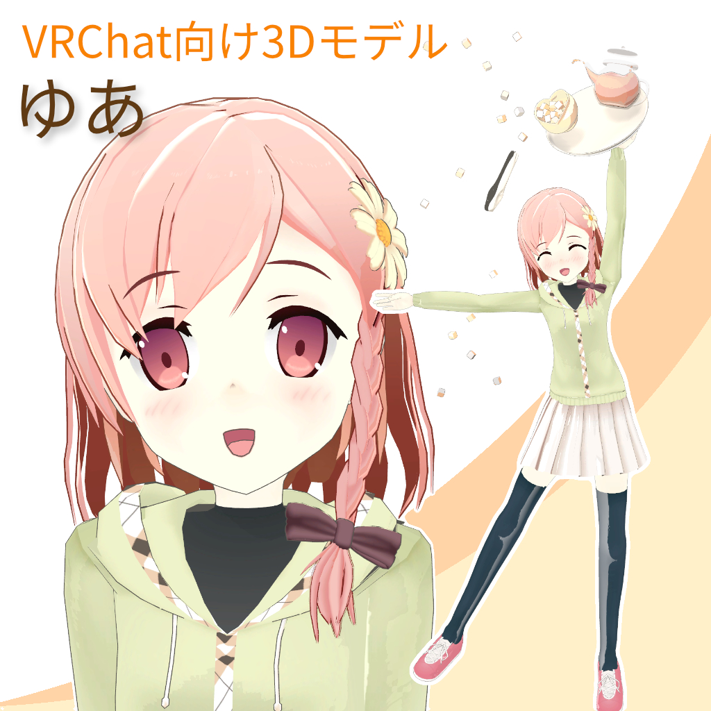
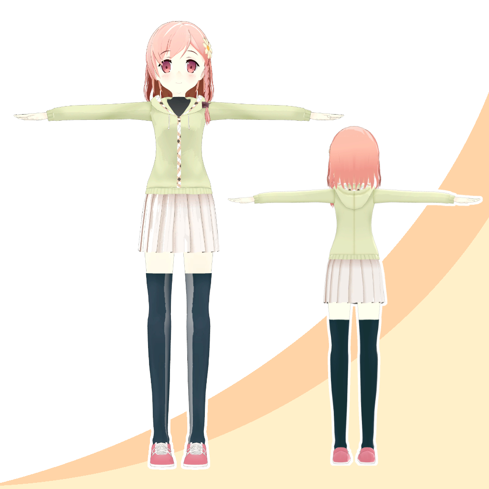

# [3Dモデル][VRC]ゆあ_yourdiary

 |  |
------|------

本3Dモデルはファン二創作品です，参考 [カントク先生](http://5-y.2-d.jp/) の『your diary』から。

## VRChatでの利用方法
1. VRCSDK_3をUnity(Unity 2019.4.31f1)に導入する。
1. [UTS2](https://github.com/unity3d-jp/UnityChanToonShaderVer2_Project) をUnityに導入する。
1. [Download](https://github.com/SilverWei/yua_yourdiary_3dModel_VRC/releases/) Linkからunitypackageをダウンロードし、Unityに導入する。
1. Sceneファイルを開くか、Prefabをヒエラルキーに展開することで使用できます。

## 内容物
- Unitypackageファイル(VRChat向けに設定済)
- 各種テクスチャPSDファイル（KIRITAにて作成）
- Blenderファイル(v2.79.bにて作成)

## 表情收录

## 利用規約
商用利用: 不可

改変: 可能

再配布: 不可(改変モデルを配布されたい場合はご連絡ください)

## 著作権
本3Dモデルは「cuffs 二次創作活動について」関するガイドライン (http://www.cuffs.co.jp/main/guideline/) に沿って制作しています。

© CUFFS/Sphere/CUBE/MintCUBE/Sonora

引用元 [your diary](http://www.cuffs-cube.jp/products/yourdiary/)
